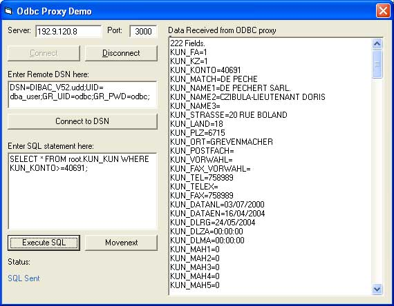



## ODBC PROXY

### Description

This source code permits to connect to a DSN ODBC connection on a remote computer running dbTCP. THis can be very useful if ODBC licences are very expensive (I had the case).
 
### More Info
 
I would like to thank:

- Fastflow.it for the dbTCP (freeware Delphi code), which must run on the remote PC. It is a small EXE file which can be run without any installation and can be downloaded at http://www.fastflow.it/dbftp/ (take Version 2).

- Oleg Gdalevich for his excellent CWinsock class, used to replace any reference to the Winsock control. It is included here but can be downloaded at www.vbip.com.

The class needs a reference to Microsoft ADO, because it simultates a Recordset in memory so it makes it very easy to replace existing code.

The Client uses a VB class module (rstWinsock) which simulates a ADODB recordset. The following has been implemented:

- PROPERTY rstWinsock.RemoteHostIP (the remote host IP address)

- PROPERTY rstWinsock.RemoteHostPort (the remote host port)

- PROPERTY rstWinsock.TimeOutSecs (the Timeout in seconds that the class waits for a server response)

- METHOD rstWinsock.ConnectSocket (establish the connection)

- PROPERTY rstWinsock.State (Connected, Not connected, Error, Timeout)

if the state = Connected, everything processed ok (check this first)

if the state = Error, check the ErrCode and ErrDescr for the error returned

- METHOD rstWinsock.ConnectRemoteDSN (initialize connection to remote DSN)

check state = Connected to see if everything is OK

- METHOD rstWinsock.ExecuteSQL (launch a SQL statement on the remote DSN)

if the SQL is a SELECT statement, the class fetches the fields and the first record

check state = Connected to see if everything is OK

if state = connected,

- check EOF to see if records are available

- access all the fields returned with the FIELDS collection

- METHOD rstWinsock.MoveNext (launch a move-to-next record on the remote DSN)

check state = Connected to see if everything is OK

if state = connected, check EOF to see if records are available

N.B. the class does not use any reference to the winsock component (it uses the excellent custom class available on www.vbip.com, written by Oleg Gdalevich, which simulates the Winsock control)

N.B. I only implemented the following field data types from ADO (N5=adSmallInt, N10=adInteger, N30=adCurrency, C=adVarChar, D=adDate). This can be changed in the "Sub GetFields" and the "Sub MoveNext".

N.B. The client is based on Server V2, but works also on the previous version (except that the date format returned from the Server is different "01/01/2000" vs "2000/01/01")

N.B. The rstWInsock class can even be compiled into a DLL and thus could be used on a IIS/ASP server, but I do not need it for the moment.

             |
---                |---
**Submitted On**   |2004-07-18 18:35:26
**By**             |[Peter Czibula](https://github.com/Planet-Source-Code/PSCIndex/blob/master/ByAuthor/peter-czibula.md)
**Level**          |Intermediate
**User Rating**    |5.0 (15 globes from 3 users)
**Compatibility**  |VB 6\.0
**Category**       |[Databases/ Data Access/ DAO/ ADO](https://github.com/Planet-Source-Code/PSCIndex/blob/master/ByCategory/databases-data-access-dao-ado__1-6.md)
**World**          |[Visual Basic](https://github.com/Planet-Source-Code/PSCIndex/blob/master/ByWorld/visual-basic.md)
**Archive File**   |[ODBC\_PROXY1771657192004\.zip](https://github.com/Planet-Source-Code/peter-czibula-odbc-proxy__1-55032/archive/master.zip)

